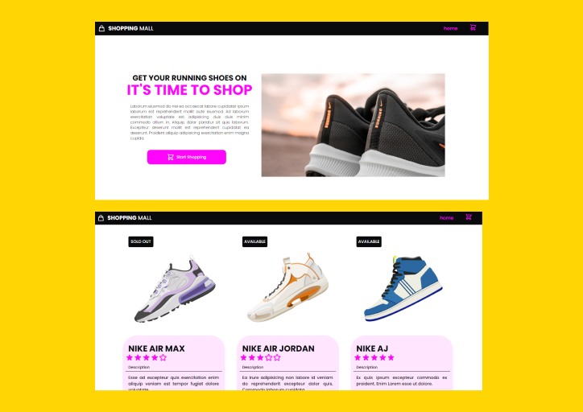

# React E-commerce Cards

## About The Project

A React App that displays a series of e-commerce cards generated from a data file. The App uses props and the map() function to iterate through an Array of Shoes and render a card for each iteration.

[Live Demo](https://skenzler.github.io/e-commerce-cards/)

## Built With

* React
* HTML5
* CSS3

## License

Distributed under the MIT License. See `LICENSE.txt` for more information.

## Contact
1. Shane Kenzler <shanekenzler@gmail.com>

## Acknowledgments

* [Github](https://github.com)
* [Figma](https://www.figma.com)
* [VS Code](https://code.visualstudio.com)
